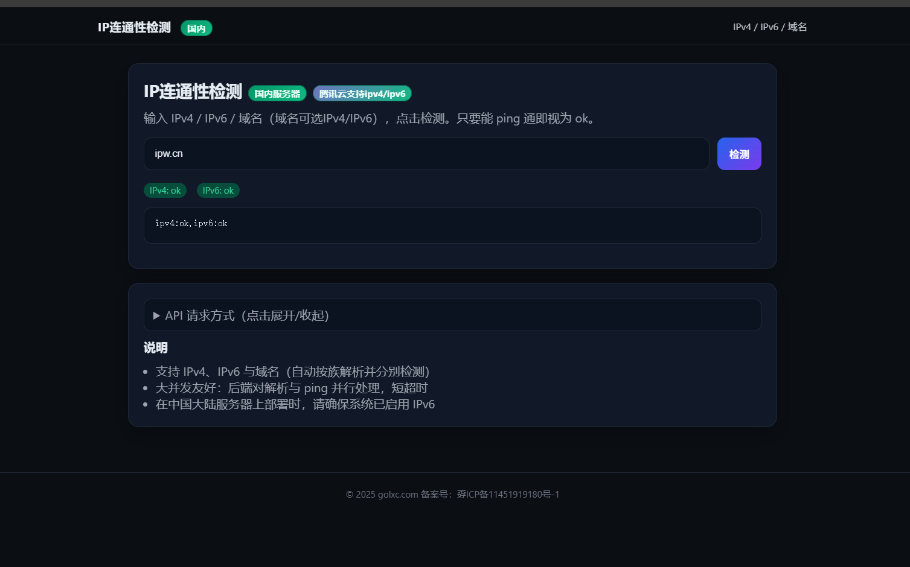
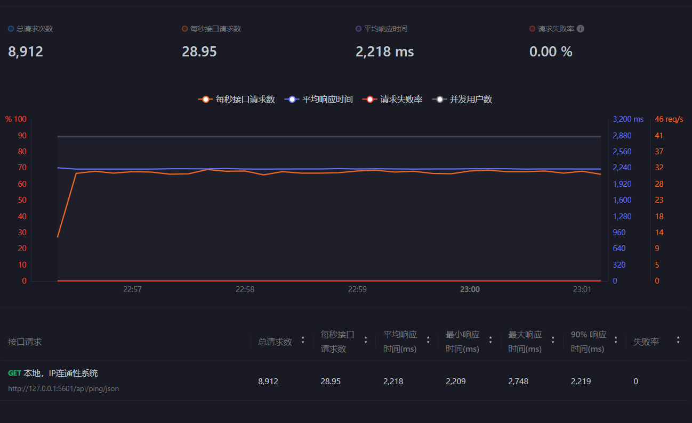

<h2 align="center">IP 连通性检测 (IPv4/IPv6) · PING 检测 · IP是否被墙</h2>
<h5 align="center">国内腾讯云服务器 · 支持 IPv4/IPv6 · 页面与 API</h5>

---

## 8W2H（精简版）
- 为什么（Why）
  - 快速判断目标 IPv4/IPv6/域名是否可达，辅助排查是否被墙/丢包/仅单栈可用
- 是什么（What）
  - 一个 Go 服务：`/` 单页页面；`/api/ping` 文本；`/api/ping/json` JSON
- 面向谁（Who）
  - 运维/开发/测试，需要快速验证连通性的用户
- 何时用（When）
  - 日常排障、发布前连通性检查、双栈可用性验证
- 在哪用（Where）
  - 部署在中国大陆服务器（腾讯云等）或本地环境
- 怎么做（How）
  - 并发解析 A/AAAA → 对各族全部 IP 并行 ICMP Echo 竞速
  - ICMP 不通则并发 TCP(443/80) 竞速兜底 → 必要时回退系统 ping
  - 每次请求内多路并发、短时限，取“任一成功=ok”
- 做到什么程度（How well）
  - 在并发 100 请求下，服务器 CPU 占用约 5%（见下方截图），延迟低且稳定
- 多少成本（How much）
  - 单二进制部署，依赖极少；前端无第三方库

## 截图（Screenshots）
<div>
  <p>首页：</p>
  
</div>
<div>
  <p>压力测试（并发100/s，CPU≈5%）：</p>
  
</div>

## 运行（Run）
```
go run .
```
- 访问：`http://127.0.0.1:5601/`
- 端口：确保 5601 被放行（作为页面与 API 端口）

## API（Usage）
- 文本
```
GET /api/ping?ip=xxx
返回: text/plain
示例: ipv4:ok,ipv6:ok
```
- JSON
```
GET /api/ping/json?ip=xxx
返回: application/json
示例: {"code":200,"msg":"success","data":{"ipv4":"ok","ipv6":"ok"}}
```
- 说明：`ip` 支持 IPv4、IPv6、域名（域名并发解析 A/AAAA，并分别检测）

## 构建（Build）
- Windows 一键：`build.bat`（全平台交叉编译，终端支持时彩色【Success】/【Error】）
- Linux/macOS 一键：`build.sh`（同功能同效果）
- 产物目录：`dist/`

## 新增特性（Latest Features）
- 实时检测：API 不做缓存控制，每次请求都实时触发检测
- 原生 ICMP 提升效率：优先使用 `x/net/icmp` + `ipv4/ipv6` 发 Echo，提高准确性与时效性
- 多级兜底：ICMP 失败并发尝试 TCP(443/80)；仍失败再回退系统 `ping`
- 高并发与限流：
  - 请求内多路并发（DNS/ICMP/TCP 竞速）
  - 进程级信号量限流（避免 goroutine 爆涨）：
    - `MAX_DNS`（默认4096）、`MAX_ICMP`（默认8192）、`MAX_TCP`（默认8192）
- 安全与稳健：
  - 输入校验 + IDNA 规范化（防止异常域名输入）
  - 自定义 HTTP 超时（ReadHeader/Read/Write/Idle）防止慢连接拖垮
  - 安全响应头：`X-Frame-Options`、`X-Content-Type-Options`、CSP 放宽到允许本页内联样式/脚本与同源请求（确保页面渲染）
- 构建脚本增强：
  - `build.bat` 自动识别 ANSI 支持（Windows10+/VSCode 终端），否则降级为无色输出
  - `build.sh` 同步目标矩阵与彩色输出

## 工作原理（Principles）
1) 输入校验与标准化：
   - 解析 `ip` 参数，如果是字面量 IP 直接检测；如果是域名，使用 `net.Resolver` 并发解析 A/AAAA
2) IPv4/IPv6 独立检测：
   - 对 IPv4/IPv6 两个“族”分别并发执行：
     - 原生 ICMP Echo（需要权限）
     - TCP 443/80 连接竞速（覆盖 ICMP 被限/墙情况）
     - 系统 `ping` 兜底（不同系统参数差异已适配）
   - 任一子步骤成功即标记该族 `ok`
3) 并发与限流：
   - 为 DNS/ICMP/TCP 设置独立信号量池，避免极端并发导致资源枯竭
   - 每族、每 IP 都是独立 goroutine 竞速，整体在请求级总超时内完成
4) 服务稳定性：
   - HTTP 超时防护 + 安全响应头；CSP 放宽仅为支持本页内联样式/脚本

## 部署（Deploy）
- Linux 原生 ICMP 建议授予：
```
sudo setcap cap_net_raw+ep /path/to/binary
```
- Windows 原生 ICMP 需管理员权限；否则自动回退系统 `ping`
- 可通过环境变量调参：`MAX_DNS`、`MAX_ICMP`、`MAX_TCP`

## 常见问题（FAQ）
- 域名偶发 `no`？
  - 可能是 ICMP 被限速/墙或临时丢包；已加入 TCP 兜底与竞速，可按需提高总超时或放大并发参数
- 双栈不对称？
  - 某些域名仅一族解析或某族在当前网络不可达，表现为 `ok/no` 或 `no/ok`

## License  许可证
BSD 开源协议（见文末说明与免责声明）

## 免责声明（Disclaimer）
本项目仅用于技术交流与学习，不用于任何非法用途。
任何使用、修改、分发、商业化等行为，都需遵循 Apache License 2.0 协议

## 联系方式（Contact）
- 网站：https://golxc.com